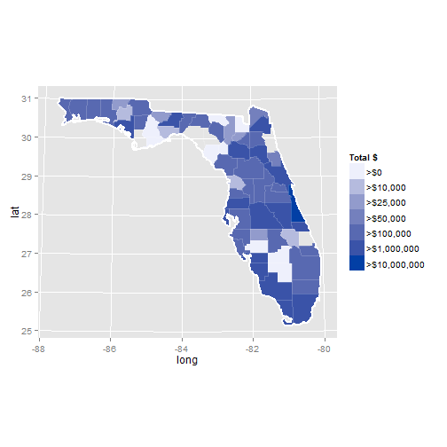

## Introduction

### Problem Statement
There has been growing concern about the amount of surplus military gear making its way to state and local law enforcement.  It first reached my attention as a resident of the Boston area after the Boston Marathon Bombing.  With the recent unrest in Ferguson, Il, the issue is getting increased coverage in the news.

### Goals
The New York Times has filed a Freedom of Information Act request to get access to the list of gear that has been transferred from the Federal Government to state and local law enforcement agencies.  They have released the raw data on Github to allow others to explore.  I am using this project as a way to do just that.

--- .class #id 

## Notes on the data

* The data that has been made available on github is only down to the county level.  There is no indication as to which city or agency the equipment has been transferred to. This means:
  * If a state-level agency is concentrated in some counties, those counties will show as having more gear
  * There are many counties that had zero records, and show up as transparent on my plots.
* Each record has a National Stock Number identifier associated with it
  * can we do anything interesting with that data? (Time may not allow me to complete this before the due-date)
  * NSN's have a 4 digit prefix that correspond to a Federal Stock Category, which is itself a separate list of codes intended to categorize similar pieces of equipment.  

--- .class #id 

## Approach

The New York Times has already implemented [their own visualization](http://www.nytimes.com/2014/08/20/upshot/data-on-transfer-of-military-gear-to-police-departments.html?abt=0002&abg=1&_r=0) of the data.  My effort will be to create something that allows a visitor to do a slightly deeper exploration of the data. 

### Initial Attempt
The Googlevis package was the first thing I tried, but it does not have the ability to plot data at a county level. The next thing I found was the rMaps project, which is by the same author as the rCharts package.  Unfortunately rMaps is not working correctly and there don't seem to be any recent updates to the project.

### Solution
Finally I found an article about how to plot county level data in ggplot2.  The solution extracts the geographic information that define the shapes of the counties and states, and draws the raw polygons to achieve the desired result.  The performance is quite slow, and it would have been nice to be able to use the rMaps package.

--- .class #id 
## Example: Florida

### Total cost of equipment transferred to Florida agencies
 

--- .class #id 
### References
* Github data: http://github.com/TheUpshot/Military-Surplus-Gear
* New York Times article: http://www.nytimes.com/2014/08/20/upshot/data-on-transfer-of-military-gear-to-police-departments.html?abt=0002&abg=1&_r=0
* rMaps: https://github.com/ramnathv/rMaps
* Choropleth example: http://www.thisisthegreenroom.com/2009/choropleths-in-r/
* NSN/FSC information: http://www.everyspec.com/FSC-CODE/ (I had to hand-format this data)
* Other: http://www.50states.com/abbreviations.htm#.U_lbYGOunwE

